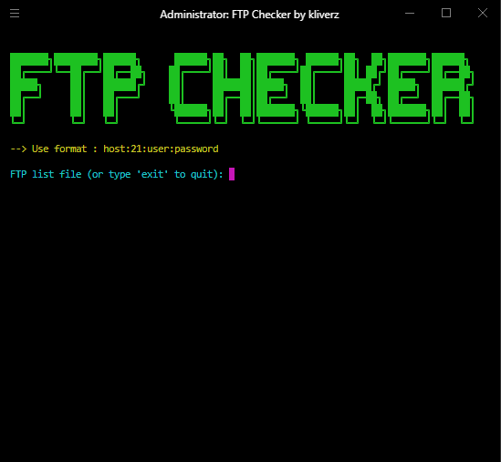

# FTP Checker by Kliverz 🚀

Tool sederhana namun powerful untuk memeriksa akses login ke server FTP dan mengumpulkan informasi penting. 



## ✨ Fitur Utama

- **Cek Login FTP**: Coba login ke server FTP dengan berbagai kredensial dan simpan hasil sukses
- **List File FTP**: Ambil dan simpan daftar file dari direktori root server FTP yang berhasil diakses
- **Interaktif & User-Friendly**: Menu interaktif yang memudahkan pengguna dalam memeriksa server FTP dan membaca file daftar FTP
- **Mode Debug**: Opsi debugging untuk troubleshooting dan analisis detail

## 📋 Requirements

Pastikan Anda telah menginstall dependencies berikut:

```bash
pip install ftplib termcolor
```

## 🚀 Cara Menggunakan

### 1. Siapkan File Daftar FTP

Buat file teks dengan format `host:port:user:password` untuk daftar FTP yang ingin diperiksa.

**Contoh format file (`ftp_list.txt`):**
```text
192.168.1.100:21:admin:password123
ftp.example.com:21:user:mypassword
10.0.0.50:2121:testuser:testpass
```

### 2. Jalankan Script

Eksekusi script [`ftp.py`](ftp.py) dan ikuti petunjuk di terminal:

```bash
python ftp.py
```

### 3. Lihat Hasil

Hasil login yang berhasil dan daftar file akan disimpan di file teks untuk referensi Anda.

## 🐛 Debugging

Untuk mengaktifkan mode debug, edit file [`ftp.py`](ftp.py) dan ubah:

```python
DEBUG = False
```

menjadi:

```python
DEBUG = True
```

Mode debug akan menampilkan detail proses dan kesalahan untuk membantu troubleshooting.

## 🤝 Bantuan & Kontribusi

Jika Anda mengalami masalah atau memiliki pertanyaan, jangan ragu untuk membuka *issue* di repository ini. Kontribusi dan saran perbaikan sangat diterima!
